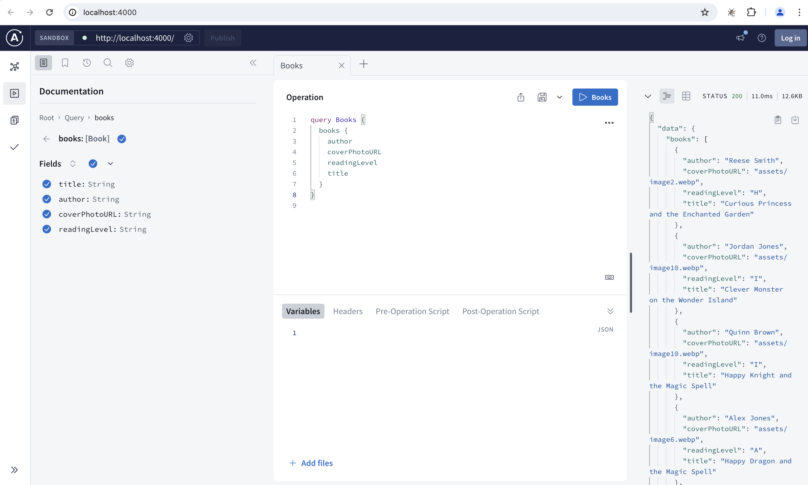

# fullstack-backend


### UI
To get access to UI that you will use for this, navigate over to this repo `https://github.com/njugunanduati/fullstack-frontend` and get the latest version. One you get it set-up and started, it will be running on `http://localhost:3000/`


### How it works
Then run the following command to install the dependancies

```bash
npm install
```

Then run the following command to start the server

```bash
npm start
```

This start a Graphql server at the url `http://localhost:4000/`, the server has a single query `books` that returns a list of books. 

```graphql
query Books {
  books {
    author
    coverPhotoURL
    readingLevel
    title
  }
}
```

